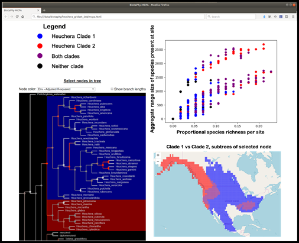

---
redirect_from:
 - /index.php.html
---
# BiotaPhy Project

**Introduction**. The BiotaPhy ("Biota-fy") Platform is a species distribution and biodiversity
modeling workflow environment.  It is a product of a three-year research and development
collaboration among [iDigBio](https://idigbio.org) at The University of Florida, 
[Lifemapper](http://lifemapper.org) at The University of Kansas, and 
[The Open Tree of Life](https://tree.opentreeoflife.org/opentree)
at The University of Michigan. The platform computes and serves a public archive of species
occurrence points for over 700,000 species from the Global Biodiversity
Information Facility (GBIF), and predicted distribution models for about a
third of those - terrestrial species with at least 20 unique,
georeferenced locations. The public archive includes models made using the Maxent algorithm
for current, predicted past, and predicted future IPCC climate scenarios
(IPCC 2014). The facility also enables researchers to request a suite of custom analyses on their own
data, or using iDigBio species occurrence data. With funding from the US NSF (BIO/DBI #1458422 and earlier awards), we
extended the platform's workflows to include the assembly of multispecies data sets
for macroecological analyses of biological diversity. We also extended the platform's
analysis capabilities to include evolutionary evidence by integrating phylogenetic data and
methods. And we scaled Biotaphy's capacity for biogeographic analyses based on species occurrence data by interfacing to XSEDE high-performance computing resources. The BiotaPhy Platform now has the algorithmic and computational capacity to process occurrence data modeling and analysis runs for tens of thousands of species on continental- and global-scale spatial extents. The BiotaPhy codebase consists of 65,000
lines of Python, plus 120,000 lines of other web code, templates, and
configuration information. BiotaPhy software is open
source, GPL3 licensed, and accessible from GitHub.

**Cluster Configuration**. The BiotaPhy Platform requires a physical or virtual
compute cluster comprised of a “front end” machine and one or more compute
nodes. The Platform is managed with Rocks software (Papadopoulos et al. 2003),
a cluster management toolkit that extends CentOS, and uses “Rolls” to bundle
software, dependencies, and scripts for portability and virtualization.
Installations are automatically tuned for local resource availability. As a
result of enforcing an underlying operating system and cluster architecture, we
streamlined the platform, shortened the development cycle, and reduced code
complexity (Williams et al. 2017). Consistent deployment allows us to test on a
variety of differently configured virtual clusters.

**Platform Architecture**. The Platform comprises four functional subsystems
(Fig. 1): 1) Data and Analysis Manager (DAM) accepts user data or retrieves
data from online data providers (iDigBio, Open Tree of Life, and GBIF),
preprocesses data sets, assembles workflows, and post-processes outputs; 
2) Compute Manager handles work queues, job distribution, and execution; 
3) Compute Engine performs the actual computations and produces raw results;
and 4) Client Interfaces simplify user access to BiotaPhy tools and data and
include the BiotaPhy web app, BiotaPhy APIs, and BiotaPhy Results Packages.
Results Packages contain embedded visualization tools in downloadable,
interactive, data packages. The web app is our user interface for browsing
public archives of species models and for initializing modeling and analysis
workflows. Users define workflows in tabbed browser pages to specify the
modeling and analyses desired, select or upload species, environmental, or
phylogenetic tree data, and then choose algorithms and parameters. Once a
workflow is defined, the DAM marshals the inputs, initiates the job, and
monitors it to completion. When analyses are complete, the DAM produces a
downloadable, autonomous results exploration package (see below).

Figure 1. *Functions of and communications between BiotaPhy subsystems. The
Data Access Manager (DAM) responds to external user communications through
Client Interfaces, then distributes data and jobs internally. Compute
Management directs jobs to and from Compute Engine, the workhorse of the
software.*

The Compute Manager interfaces the DAM server with the Compute Engine. It
defines and manages compute jobs using the Makeflow and Work Queue libraries
from the Cooperative Computing Lab (CCL, Yu et al. 2010). These packages handle
dependency management and complete computations using the master/worker
paradigm, enabling workflows to scale simply by adding additional computational
workers. We have worked with the CCL on extensions to their tools for
challenges specific to BiotaPhy workflows, primarily for handling larger-scale
and asymmetric computations.

**Species Model Archive and Macroecological Analysis**. The production
installation of the BiotaPhy Platform is populated with GBIF species
point occurrence data and modeled distributions for terrestrial plant and
animal species. This model archive is web-accessible and is primarily useful
for general browsing and casual discovery, but research use of the platform
employs BiotaPhy’s capabilities for researcher-defined species modeling and
analyses, typically using vetted, custom data. BiotaPhy’s interactive web
application accepts uploaded files of species occurrence point data, range
maps, or modeled species distributions as inputs for the creation of
presence-absence matrices (PAMs). PAMs are binary matrices representing the
actual or modelled incidence of species sorted into a geospatial grid of custom
spatial scope and resolution. PAMs are used as input data sets for many types
of biogeographical analyses; BiotaPhy’s distinctive contribution to PAM
computing over other related software is with its unique set of analysis
capabilities and its transformative compute scaling. Several integrated
biodiversity informatics platforms have appeared in the last decade—e.g., 
Biodiverse (Laffan et al. 2010); Phytools (Revell 2012);
Phylolink (Miller et al. 2018); and GeoDa (Anselin et al. 2006). BiotaPhy
occupies a unique niche in the ecology/evolution software environment as many
of these tools only perform a subset of BiotaPhy functions: acquiring and
serving data, analyzing and visualizing results in an interactive environment.
In addition, BiotaPhy’s scalable architecture allows it to handle very large
analyses, such as thousands of species at high resolution for large geographic
extents, by allowing installation on high-performance resources, like virtual
clusters with multiple powerful compute nodes on San Diego Supercomputer Center's
XSEDE resource, Comet.

**Scalable Performance Design**. BiotaPhy’s compute architecture can routinely
work with PAMs with millions or billions of cells, but with data sets of that
size, traditional algorithms for randomizing PAMs for null hypothesis testing--
such as Gotelli’s swap (Gotelli & Entsminger 2003)--break down
(Sanderson & Pimm 2015). To handle massive PAMs, we developed an algorithm for
true equal-probabilistic matrix randomizations that maintains required
conditions for null hypothesis testing and takes advantage of parallelism to
randomize PAMs in a fraction of the time required by the standard method
(Grady et al. in prep). Now analyses that previously required days or weeks, complete
in a few hours. Our capacity for computing with continental- and global-scale
PAMs far surpasses earlier applications as we can efficiently perform robust permutation
testing using a much larger number of randomizations.

As part of our network integration of the iDigBio, Open Tree of Life, and Lifemapper, we
implemented a suite of multi-species and phylogenetic analyses that were made possible by the convergence of data from the three  data communities. The Biotaphy Platform now includes quantifications and
qualifications of PAMs including calculation of Whittaker’s multiplicative
beta, Lande’s additive beta, Legendre’s beta, richness-field of a species,
dispersion-field of a species, matrix of covariance of composition of sites,
matrix of covariance of ranges of species, mean composition covariance, mean
range covariance, Schluter sites-composition covariance, Schluter
species-ranges covariance, Wright & Reeves’ nestedness, and Stone & Roberts’
C-score (all enumerated in Soberon & Cavner 2015). We implemented Peres-Neto’s
methodology for Meta-Community Phylogenetic Analysis
(MCPA, Leibold et al. 2010)--an approach to tease apart the effects of
historical biogeography and contemporary environmental filtering on 
contemporary geospatial patterns of biological diversity.

**Results Packages**. To enable desktop/laptop review of modeling results
without the need for a continuous BiotaPhy server connection, the Platform
produces downloadable Results Packages as standalone browser-based apps
containing all modeling results, including multi-species outputs, PAMs, various
spatial statistics, MCPA results, and annotated phylogenetic trees.
Visualization tools are embedded in the packages, including a tree navigator,
statistical visualizations, heat maps, and correlation graphs (Fig. 2). The
Results Package includes a phylogenetic tree browser, a
geographical map of site diversity, and a scatter plot of various site-based or species-based
statistics. Brushing data in one window highlights the same data points in linked
displays, enabling visual exploration of species diversity patterns across
evolutionary, ecological, and statistical dimensions.

  

Figure 2. *BiotaPhy Results Package display showing a linked visualization of
some of the output data. In this example, the user has selected a node in the
phylogenetic tree, highlighting the clades on either side of the chosen node
(lower left). This results in highlighted areas in the map (lower right)
showing the aggregated distributions of those same clades. Finally, the sites
on the map are displayed in a plot of two statistics, Proportional species
richness per site, and Aggregate range size for all species present in each
site.*

Literature Citations [here](/literature).

The BiotaPhy project is an open source software collaboration among
[iDigBio](https://idigbio.org) at The University of Florida, 
[Lifemapper](http://lifemapper.org) at The University of Kansas, and 
[The Open Tree of Life](https://tree.opentreeoflife.org/opentree)
at The University of Michigan supported by U.S. NSF BIO/DBI Award #1458422. The goal of the BiotaPhy Project 
is to establish an extensible, scalable, biodiversity science gateway for
scalable, convergent biodiversity analyses that utilize massive and growing online data stores 
of species data from biological museums in workflows that are repeatable, robust, and supported.

 
 
 

## Links:

Please visit our websites to see what we are doing and find out more about our projects:
 * [BiotaPhy Web Client](http://client.lifemapper.org/biotaphy)
 * [Lifemapper GitHub Pages](https://lifemapper.github.io)

Also check out our other code repositories on GitHub:
 * [BiotaPhy Analyses](https://github.com/biotaphy/analyses)
 * [Lifemapper Client Library](https://github.com/lifemapper/lm_client)
 * [BiotaPhy Open Tree Wrapper Client](https://github.com/biotaphy/ot_service_wrapper)
