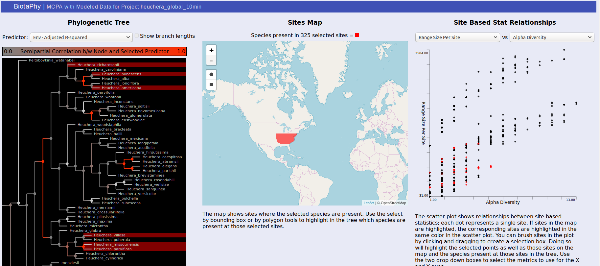

# Results Package
The BiotaPhy results package includes all of the single and multi-species
analyses performed for a particular project in a zip file download.  Other than
map base layers, the entire package is self-contained and does not require an
internet connection.  An example results package for the public Heuchera
project can be downloaded from
http://client.lifemapper.org/dl/heuchera_demo.zip.  User packages can be
retrieved from the BiotaPhy web UI at http://client.lifemapper.org/biotaphy.
Completed projects are listed in the left side panel and when they are selected
a "Download Results Package" button will allow you to retrieve the package.
Download the demo package, or a user package, and unzip the file on your local
machine.

----
## Table of Contents
- [Results Package](#results-package)
  * [Index page (index.html)](#index-page--indexhtml-)
  * [MCPA with Modeled Data (statsTreeMap.html)](#mcpa-with-modeled-data--statstreemaphtml-)
  * [Modeled Map Statistics (statsHeatMap.html)](#modeled-map-statistics--statsheatmaphtml-)
  * [Browse Model Maps (browse_maps.html)](#browse-model-maps--browse-mapshtml-)
  * [Species Distribution Models Directory Listing](#species-distribution-models-directory-listing)
  * [CSV Output Files from Multi-Species Analyses Directory Listing](#csv-output-files-from-multi-species-analyses-directory-listing)

----

## Index page (index.html)
The package contains an index file, index.html, that serves as a landing point
where you can browse available outputs.  The “MCPA with Modeled Data” link
shows the MCPA results, “Modeled Map Statistics” shows the results of the
multi-species computations for various diversity metrics, “Browse Model Maps”
shows the SDM map images, and the “Species Distribution Models Directory
Listing” and “CSV Output Files from Multi-species Analyses Directory Listing”
options provide access to the raw output files in the package.

  

----

## MCPA with Modeled Data (statsTreeMap.html)

MCPA outputs can either be viewed through the link on the index.html page, or
directly from statsTreeMap.html.  The page may take a couple of seconds to load
depending on the size of the result dataset but will show three panels.  The
first, on the left, displays the phylogenetic tree used for MCPA, the middle
panel shows a map that will display selected sites, and the right panel shows
a scatterplot displaying the relationship between two selected site-based
statistics.

  

For the tree, the color of each node in the tree indicates the correlation
between that node and the selected predictor.  Usually, these are best observed
with "Env -- Adjusted R-squared" and "BG -- Adjusted R-Squared" which show the
correlation with the environmental variables and biogeographic hypotheses
respectively.  Brighter red indicates that the correlation is stronger.
Clicking on a node will show the distributions of each of the sister clades
under it on the map.  One will be shown in red, the other blue, and sites where
both clades are present are shown in purple.  The same colors are used to
highlight the same sites in the scatterplot.  You can change the selected
predictor from the drop down box above the tree display.

  

The middle panel displays a map showing selected data.  There are rectangle and
polygon selection tools that can highlight areas on the map.  Those selections
then update the tree display to show species present at those sites and the
scatterplot display to show the corresponding sites.

  

Selection via the tree or the map also highlights dots in the scatterplot on
the right.  Each dot represents a site and their distribution is determined by
the statistics you select.  This can be used to show common patterns of
biodiversity between the statistics and the highlighted sites can give you an
idea of their relative biodiversity.  You can also brush the sites in the
scatterplot to highlight the corresponding sites on the map as well as the
species present at those sites in the tree.

  

----

## Modeled Map Statistics (statsHeatMap.html)

The "Modeled Map Statistics" page, statsHeatMap.html, shows a heat map style
display of a single site-based statistic.

  

You can select which statistic you wish to display from the drop down at the
top of the page.  The scale is displayed at the right of the map and a
description of the selected statistic can be found under the map.

  

----

## Browse Model Maps (browse_maps.html)
You can browse maps from the "Browse Model Maps" page, browse_maps.html.  This
page shows static map images of the projections.

  

Metadata about each projection are displayed under the map images.  This
metadata includes the species name, algorithm used, climate data used, and a
link to the data raster.

----

## Species Distribution Models Directory Listing
The species distribution models directory listing (this is the same as the 
gridset/sdm/ folder in the package).  Lists all of the SDMs included in the
package.

  

Note that different browser / operating system combinations will change how
this is displayed.  The index page just provides convenient access to these
files within your browser.

----

## CSV Output Files from Multi-Species Analyses Directory Listing
Like the SDM directory listing, the csv output files listing is just a
connection to a directory within the output package.  In this case, it is the
gridset/matrix/ directory.  The files listed here are the matrix ouputs
converted to CSV files for inspection with other softwares.
 

  

 