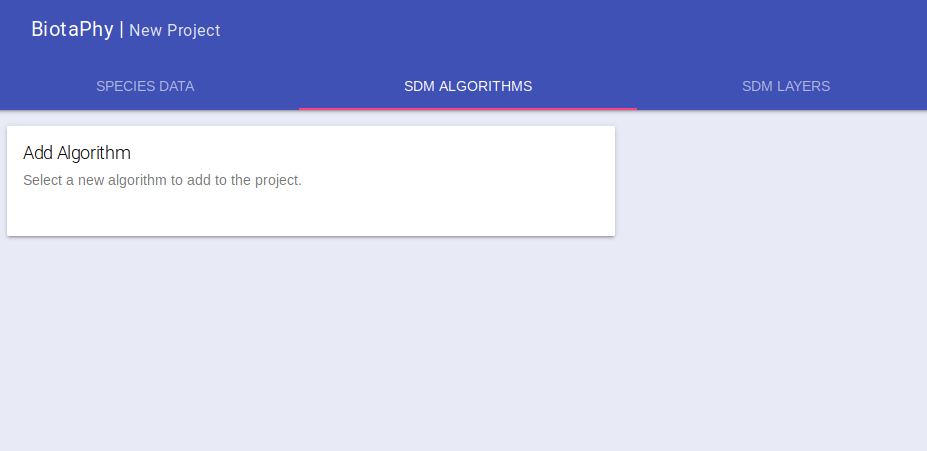
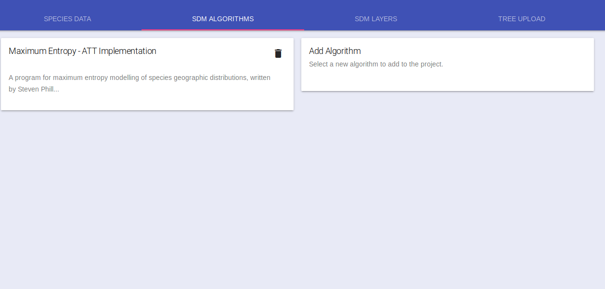
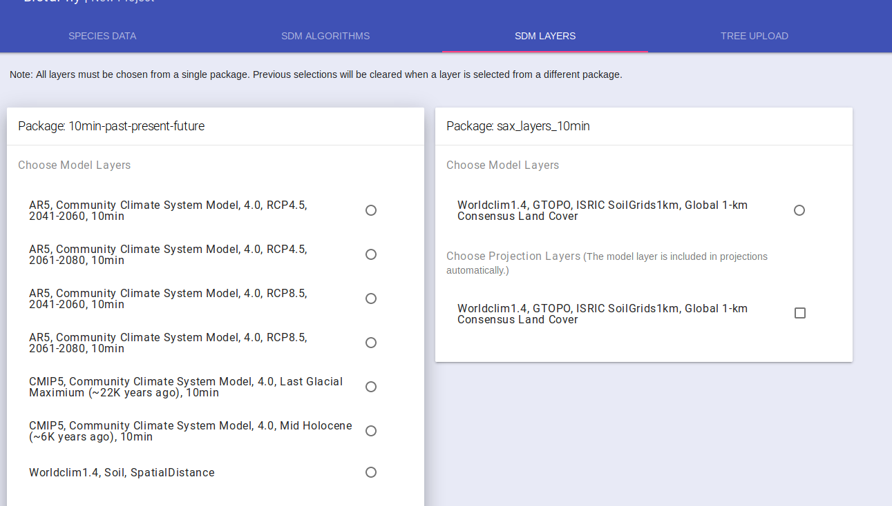
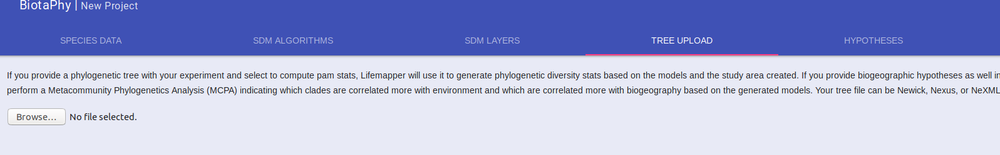
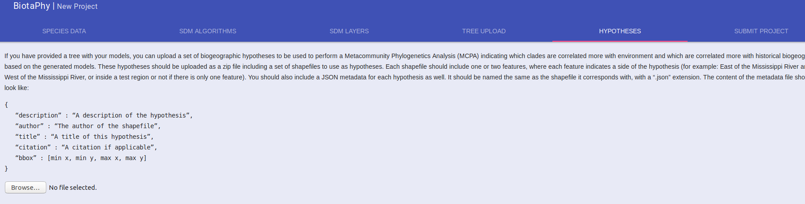
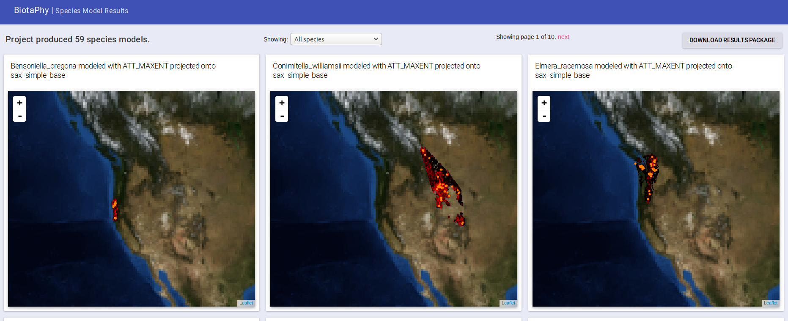

# Web Client
The Biotaphy web client allows users to submit single or multi-species
experiments via a web UI.  It is intended for smaller projects (less than
1000 species) and our standard climate data.  For larger experiments, or for
assistance with Metacommunity Phylogenetic Analysis (MCPA),
[contact us](mailto:lifemapper@ku.edu).

----
## Table of Contents
- [Web Client](#web-client)
  * [Authenticate](#authenticate)
  * [New Project](#new-project)
  * [Occurrence Data](#occurrence-data)
    + [Occurrence Data - Species List](#occurrence-data---species-list)
    + [Occurrence Data - Taxon Tree](#occurrence-data---taxon-tree)
    + [Occurrence Data - GBIF](#occurrence-data---gbif)
    + [Occurrence Data - Upload](#occurrence-data---upload)
  * [Add Algorithms](#add-algorithms)
  * [Select Climate Data](#select-climate-data)
  * [Upload Phylogenetic Tree](#upload-phylogenetic-tree)
  * [Upload Biogeographic Hypotheses](#upload-biogeographic-hypotheses)
  * [Submit Project](#submit-project)

----
## Authenticate
If you want to perform anything more than a small demo experiment, you will
want to sign up for an account.  Do thatby clicking the sign up link under the
login box on the left side of the page.  It may take a few seconds for the page
to load as it is checking for available data packages that you may have already
submitted as well as public data.

<p align="center">
  
</p>

Fill in the new user form and click “SIGN UP”.  You will then be authenticated
with your new user account.  Your user name will appear in the left side bar.

 
<p align="center">
  
</p>

----

## New Project
After you have authenticated, or if you just want to try a small project, click
the link called "+ New Project" in the left-side pane.  You will be presented
with the input tabs for your new project.  You will need to give your new
project a name and we recommend that you do that first.  You can do that in the
left side bar under "New project name".

<p align="center">
  
</p>

At this time, the the only workflow available through the web UI is one
starting at Species Distribution Models and optionally performing multi-species
statistical analyses.  Follow the following steps:
 1. [Select Occurrence Data](#Occurrence-Data)
 1. [Select Modeling Algorithms](#Add-Algorithms)
 1. [Select Climate Data](#Select-Climate-Data)

If you want to perform multi-species analyses, you may want to provide a
phylogenetic tree.  If you want to perform MCPA, you will need to provide a
tree and biogeographic hypotheses.
 1. [Upload a tree](#Upload-Phylogenetic-Tree)
 1. [Upload Hypotheses](#Upload-Biogeographic-Hypotheses)
 
Finally, you will want to [Submit your project](#Submit-Project)

----

## Occurrence Data
Click on the "SPECIES DATA" tab.  There are four options for providing
occurrence data.  You can 
 1. [provide a list of species](#Occurrence-Data---Species-List)
 1. [select species from a taxon tree](#Occurrence-Data---Taxon-Tree)
 1. [select existing occurrence data from GBIF](#Occurrence-Data---GBIF) 
 1. [upload your own occurrence CSV file](#Occurrence-Data---Upload)

----

### Occurrence Data - Species List
If you want to provide a list of species and have occurrence data retrieved
from iDigBio, from the "SPECIES DATA" tab, select the "List of Species" radio
button.  This is the default option and you will be presented with a text box
that you can enter species names into, one per line. 
<p align="center">
  
</p>

Input your species names and then click the "Match" button.  A query will be
performed to GBIF, iDigBio and Open Tree of Life to find available data.  

<p align="center">
  
</p>

The results will be returned in a table showing the search string you provided,
the matching GBIF accepted name, how many occurrence points were found in
iDigBio, whether the taxon was found in Open Tree, and an option to include
the data in the project or not.  Select the data you want to include and then
proceed to [Add Algorithms](#Add-Algorithms).

----

### Occurrence Data - Taxon Tree
If you want to select several taxa from the same group, you can do that from
the taxon tree interface.  From the "SPECIES DATA" tab, select the
"Taxonomic Search" radio button.  This search will let you drill down through
the taxonomic information that Lifemapper has from a cache of the GBIF
taxonomy.
<p align="center">
  
</p>

Start with Kingdom and pick the taxonomic group you are interested in.  It may
take a few seconds to update the UI between selections.  Once your query
matches a small enough subset of taxa, they will be displayed in the matching
species box.  Select the species that you want to include in your project and
then click the ">" button to move them to the selected species box.  Continue
to select species until you have all of the species you wish to include in the
selected species box.  You can move species out of the selected species by
clicking them and then the "<" button.

<p align="center">
  
</p>

When you have selected all of your species, click match.

<p align="center">
  
</p>

The results will be returned in a table showing the taxon string, how many
occurrence points were found in iDigBio, whether the taxon was found in Open
Tree, and an option to include the data in the project or not.  Select the data
you want to include and then proceed to [Add Algorithms](#Add-Algorithms).

----

### Occurrence Data - GBIF
You can view and use data from GBIF that Biotaphy has already acquired.  To do
so, select the "Use GBIF data" radio button under the "SPECIES DATA" tab.  You
will be presented with a search field.  Start typing the name of a species that
you are interested in and matching taxa will be autocompleted after you type
the first few characters.

<p align="center">
  
</p>

Only the first few matches are displayed so some species may require you to
enter more of the species name than others.  Once the species you are
interested in is in the matches, select it.

<p align="center">
  
</p>

After selecting a species, the map on the right will be updated to include the
occurrence points for that species.  You can then perform the search again to
add more species to your project.  You can remove a species by clicking on the
trash can icon.  If you have selected multiple species, the eye icon controls
which species is displayed on the map.

Select the species you wish to include and then proceed to
[Add Algorithms](#Add-Algorithms).

----

### Occurrence Data - Upload
You can upload your occurrence data via the "Upload CSV file of species
points" radio button on the "SPECIES DATA" tab.
<p align="center">
  
</p>
Browse to the CSV file you want to upload and select it.

The UI will read the headers of your CSV file and present you with options for
defining each column.  Select the appropriate options for your CSV.  Note that
you must indicate that one column as “Taxon” for you species name column.  One
must be selected as “Longitude” and finally one must be “Latitude”.  You can
change the name of your file if you wish and select upload

<p align="center">
  
</p>
 
Your file will be sent to the server and a progress bar will be displayed.
Once the file is successfully uploaded, a message indicating that will be
displayed.  After that appears, proceed to [Add Algorithms](#Add-Algorithms).

----

## Add Algorithms
Click on the "SDM ALGORITHMS" tab, you can select one or more algorithms for
your project, if you are wanting to run multispecies analyses, we recommend
just selecting one.  Hover over the “Add Algorithm” card and select the
algorithm you want.  

<p align="center">
  
</p>

The card will be updated with the default algorithm parameters which you can
change as needed.

<p align="center">
  
</p>

Add additional algorithms if you wish and move on to 
[Select Climate Data](#Select-Climate-Data).

----
 
## Select Climate Data
The "SDM Layers" tab displays the available climate data you can use for your
models.  Each card represents a package of scenarios and will allow you to
select the climate scenarios to be used for creating Species Distribution
Models.  The radio buttons represent the scenario used for creating the model
ruleset.  Select one of these radio buttons.  You have the option to select one
or more climate scenarios to project the model ruleset.  Select the check box
by each of the scenarios you wish to use for projections, the model scenario
is already selected.  For multi-species analyses, only the model scenario
will be used.

<p align="center">
  
</p>

If you only want to perform SDMs, you can move on to 
[Submit Project](#Submit-Project).  If you wish to perform multi-species
analyses, you may want to [Upload a Tree](#Upload-Phylogenetic-Tree). 

----
 
## Upload Phylogenetic Tree
If you wish to perform MCPA, or you want to include Phylogenetic statistics
with the multi-species analyses, you will need to provide your tree.  That can
be done under the “TREE UPLOAD” tab.  Browse to your tree file and select
it.

<p align="center">
  
</p>

Like the occurrence data upload, a progress bar is displayed as your file
is uploaded and a message indicating when it has been uploaded successfully
will be displayed.

If you wish to compute MCPA, continue on to 
[Add Hypotheses](#Upload-Biogeographic-Hypotheses), otherwise,
[Submit Project](#Submit-Project).

----

## Upload Biogeographic Hypotheses
To perform MCPA, you must provide biogeographic hypotheses.  Select the
"HYPOTHESES" tab and upload your hypotheses in a zip file.

<p align="center">
  
</p>

At this time, the
hypotheses must be provided in a single zip file.  In that zip file, each
hypothesis should be included as a shapefile with one or two features.
Shapefiles with one feature will be treated as hypotheses that look for data
that is either in the feature, or not.  If the shapefile has two features, the
hypothesis will compare data that is in one feature versus data that is in the
other.  In either case, a matching JSON file must be included for each
hypothesis that looks like:
```
{
   “description” : “A description of the hypothesis”,
   “author” : “The author of the shapefile”,
   “title” : “A title of this hypothesis”,
   “citation” : “A citation if applicable”,
   “bbox” : [min x, min y, max x, max y]
}
```

[Let us know](mailto:lifemapper@ku.edu) if you want help constructing your
hypotheses and we would be happy to assist you.

After uploading your hypotheses, move on to [Submit Project](#Submit-Project).

----

## Submit Project
Finally, select the “SUBMIT PROJECT” tab.  This tab shows you what data you
have provided for your project.  If you have run through the steps that I have
listed, each of the check boxes should be checked.  There is a final toggle for
computing PAM stats.  These statistics also include MCPA, so toggle that to on.
The toggle will turn blue.  Now click “SUBMIT PROJECT” to send your project
configuration to the server.  Note that if any of the check boxes are not
checked,  you will need to fill those in first.  The easiest one to miss in my
opinion is naming your project, so make sure you have done that.

 
Once you click submit project, you will see a message indicating that the
project is being submitted.  It may spin for a few seconds before changing the
message to “Requesting status”.  This indicates that the project is on the
system and will run.  The message will be updated as the status changes and the
project moves in the line of computations.  Depending on how long the line is
and the computations in front of yours, this could take a while.  User jobs
should be moved to the front of the queue though so hopefully not too long.
At this point, you can wait for your results or come back later.

If you choose to come back later, go to the same url: 
http://client.lifemapper.org/biotaphy and as long as you are still
authenticated (indicated by your name in the left side) you will see your
projects listed under the “New Project” link.  A check mark next to the project
name indicates that it has finished.  An hour glass indicates it is still
running and an exclamation point indicates that there was a problem.  If you
see an exclamation point, [let us know](mailto:lifemapper@ku.edu) and we will
look into what may have gone wrong.

Once your project has completed, select it from the left side.  It will take a
few seconds to load your maps, but they should come back.  You can browse them
in the UI by panning and zooming to view the mapped data.  Note that the maps
are centered and may not show your projected data if it is near the extremes
until you pan to it.  You can select maps for specific species or page through
them with the navigation options above the maps.

<p align="center">
  
</p>

You can also download the output package form the “DOWNLOAD RESULTS PACKAGE”
button.  This will take some time to assemble all of your results (this will be
sped up later so you don’t have to wait as long).  That results package is what
I have sent you previously for your earlier projects.  Download that to have a
local copy of the generated outputs.

 
