# Web Client

** Authenticate **
If you want to perform anything more than a small demo experiment, you will
want to sign up for an account.  Do thatby clicking the sign up link under the
login box on the left side of the page.  It may take a few seconds for the page
to load as it is checking for available data packages that you may have already
submitted as well as public data.

  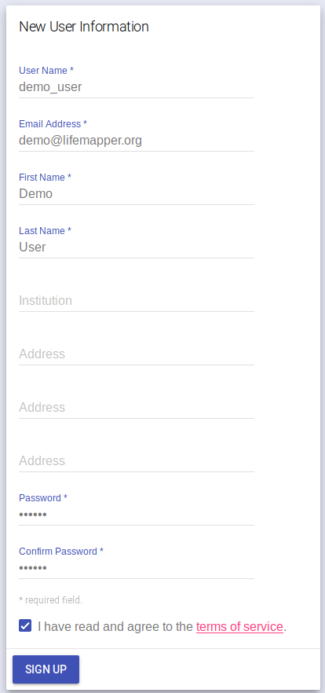

Fill in the new user form and click “SIGN UP”.  You will then be authenticated
with your new user account.  Your user name will appear in the left side bar.

 

  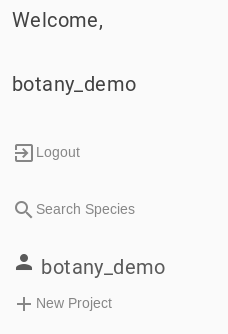

** New Project **
After you have authenticated, or if you just want to try a small project, click
the link called "+ New Project" in the left-side pane.  You will be presented
with the input tabs for your new project.  You will need to give your new
project a name and we recommend that you do that first.  You can do that in the
left side bar under "New project name".

  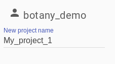

** Occurrence Data **
Click on the "SPECIES DATA" tab.  There are four options for providing
occurrence data.  You can 
[provide a list of species](#Occurrence-Data---Species-List), 
[select species from a taxon tree](#Occurrence-Data---Taxon-Tree), 
[select existing occurrence data from GBIF](#Occurrence-Data---GBIF), or 
[upload your own occurrence CSV file](#Occurrence-Data---Upload).

** Occurrence Data - Species List **

  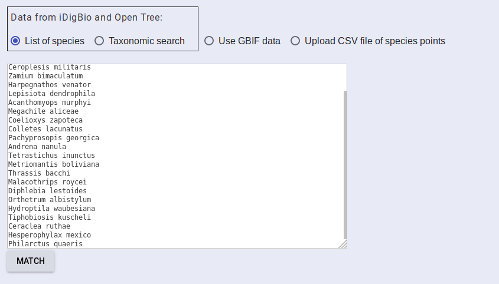

  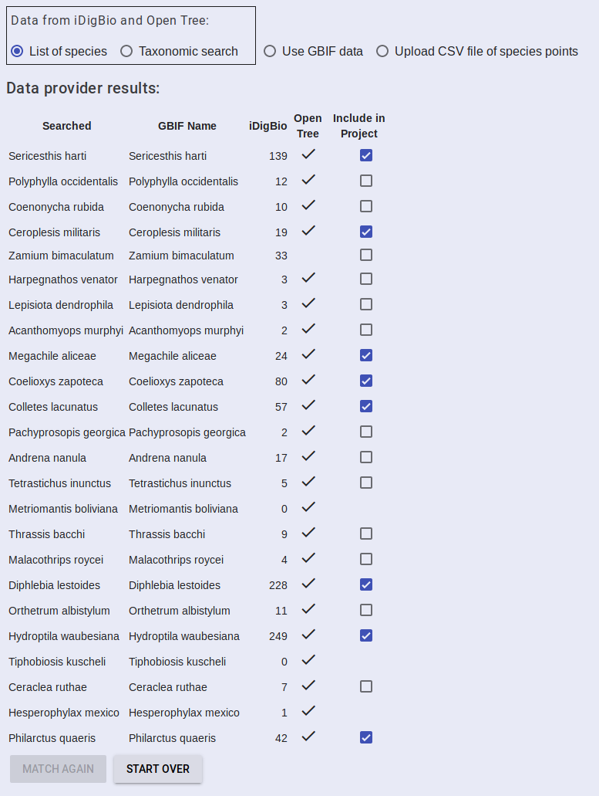

** Occurrence Data - Taxon Tree **

  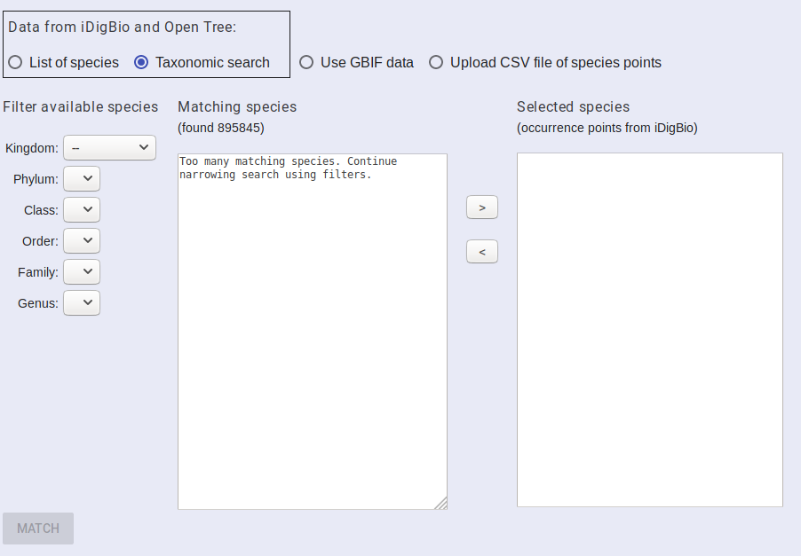

  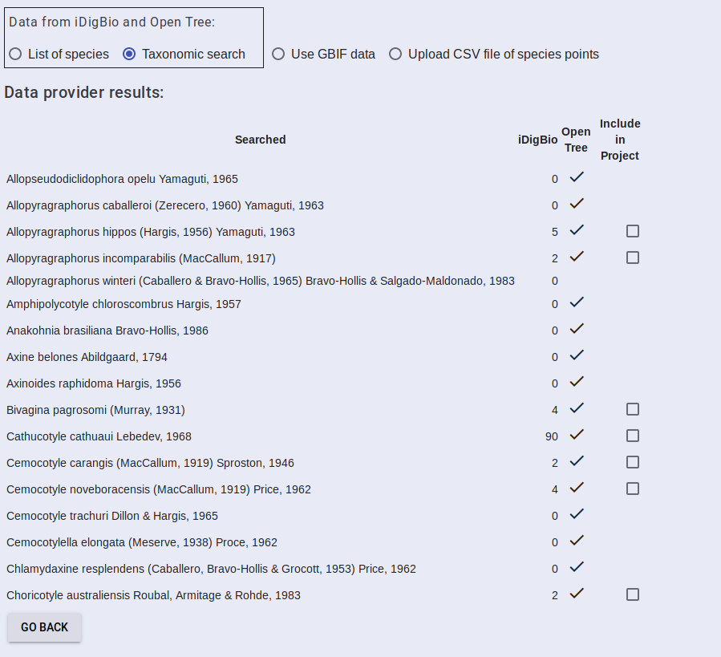

  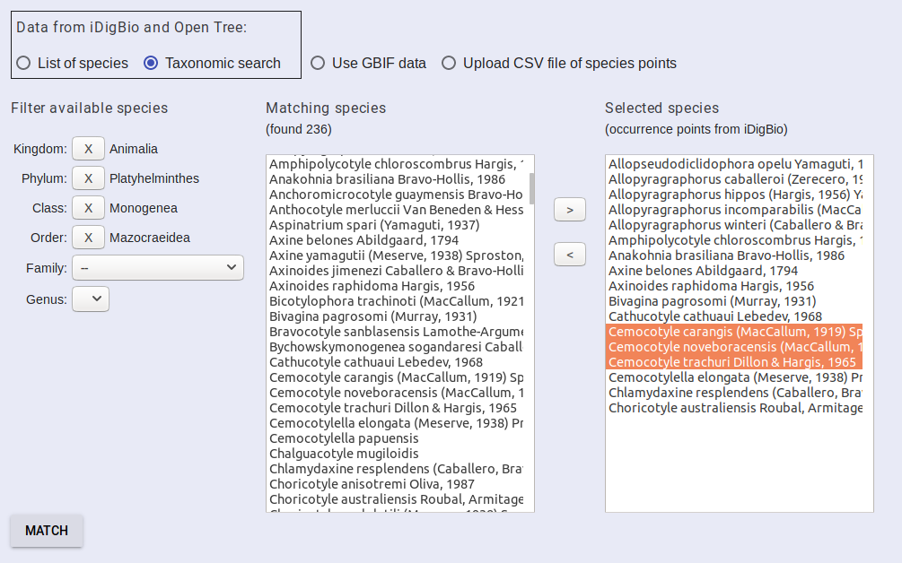

** Occurrence Data - GBIF **

  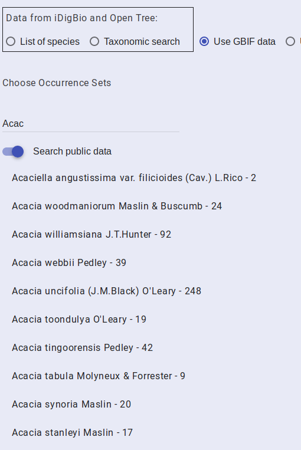

  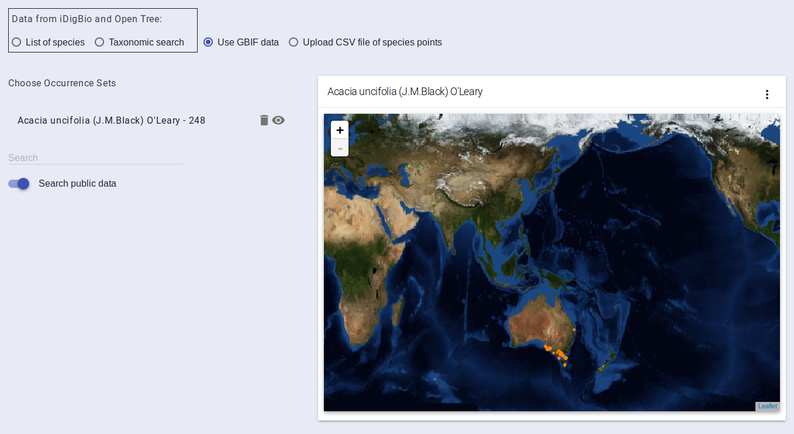

** Occurrence Data - Upload **
You will upload your occurrence data via the "Upload CSV file of species
points" radio button on the "SPECIES DATA" tab.

  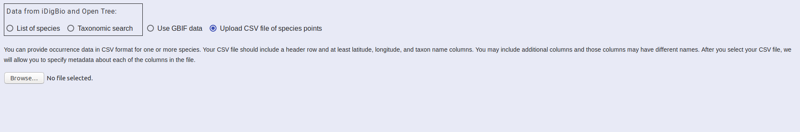

Browse to the CSV file you want to upload and select it.

The UI will read the headers of your CSV file and present you with options for
defining each column.  Select the appropriate options for your CSV.  Note that
you must indicate that one column as “Taxon” for you species name column.  One
must be selected as “Longitude” and finally one must be “Latitude”.  You can
change the name of your file if you wish and select upload

  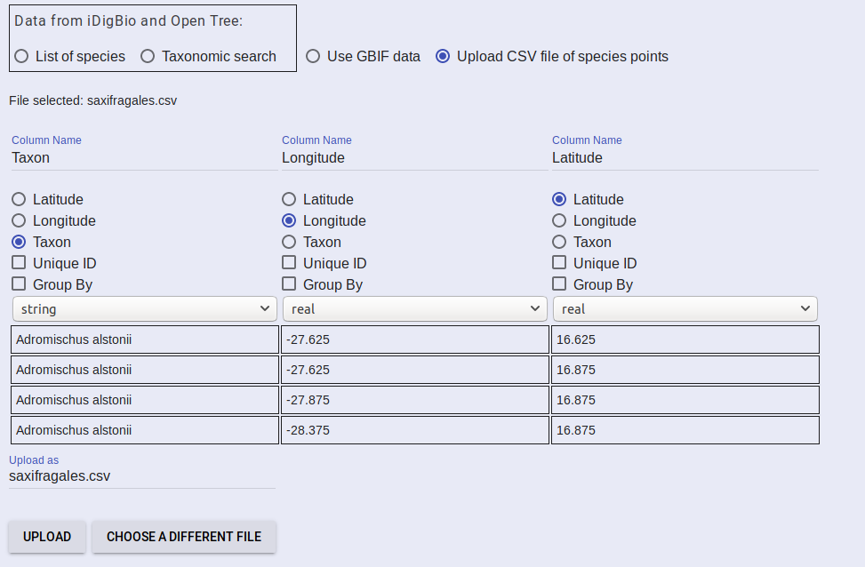

 
Your file will be
sent to the server and a progress bar will be displayed.  Once the file is
successfully uploaded, a message indicating that will be displayed.  Once that
appears, select the “SDM ALGORITHMS” tab. 

** Add Algorithms **
 

You can select one or more algorithms for your project, if you are wanting to run multispecies analyses, I recommend just selecting one.  Hover over the “Add Algorithm” card and select the algorithm you want (probably Maximum Entropy – ATT Implementation).  The card will be updated with the default algorithm parameters which you can change as needed.  After you have made your selections, select the “SDM LAYERS” tab.

 

The SDM Layers tab displays the available climate data you can use for your models.  You will probably want to use the 10min-past-present-future package.  The card will display radio buttons with the available climate scenarios for the model.  If you are using 10min-past-present-future, you will want to select “Worldclim 1.4, Soil, SpatialDistance” as your model scenario.  After you have selected your model scenario, you can select additional scenarios for projecting your model.  For multi-species analysis, only the model scenario will be used.

 

Next, if you wish to perform MCPA, you will need to provide your tree.  That can be done under the “TREE UPLOAD” tab.  Browse to your tree file and select it.  Like the occurrence data upload, a progress bar is displayed as your file is uploaded and a message indicating when it has been uploaded successfully will be displayed.  Once it is uploaded, select the “HYPOTHESES” tab.

 

For hypotheses, upload the attached file.  This is a zip file with the hypothesis shapefiles you provided me previously with metadata files for each one.  This portion of the UI will need to be improved with time, but we need to find out how often people have the appropriate data first.  Once you feel comfortable with the UI, I may ask that you try to create a hypothesis zip file and upload it to see if the instructions are clear.  For now, just use the provided file.  Another note, if you are going to perform multiple experiments using the same hypotheses, you will need to name the file something different each time.  Our plan is to eventually let you select existing data, but for now you cannot.  When I test the UI, I usually append the name of the project to the hypotheses name so I know it won’t already exist.

 

Finally, select the “SUBMIT PROJECT” tab.  This tab shows you what data you have provided for your project.  If you have run through the steps that I have listed, each of the check boxes should be checked.  There is a final toggle for computing PAM stats.  These statistics also include MCPA, so toggle that to on.  The toggle will turn blue.  Now click “SUBMIT PROJECT” to send your project configuration to the server.  Note that if any of the check boxes are not checked,  you will need to fill those in first.  The easiest one to miss in my opinion is naming your project, so make sure you have done that.

 

Once you click submit project, you will see a message indicating that the project is being submitted.  It may spin for a few seconds before changing the message to “Requesting status”.  This indicates that the project is on the system and will run.  The message will be updated as the status changes and the project moves in the line of computations.  Depending on how long the line is and the computations in front of yours, this could take a while.  User jobs should be moved to the front of the queue though so hopefully not too long.  At this point, you can wait for your results or come back later.

 

If you choose to come back later, go to the same url: http://client.lifemapper.org/biotaphy and as long as you are still authenticated (indicated by your name in the left side) you will see your projects listed under the “New Project” link.  A check mark next to the project name indicates that it has finished.  An hour glass indicates it is still running and an exclamation point indicates that there was a problem.  If you see an exclamation point, let me know and I will look into what may have gone wrong.

 

Once your project has completed, select it from the left side.  It will take a few seconds to load your maps, but they should come back.  You can browse them in the UI by panning and zooming to view the mapped data.  Note that the maps are centered and may not show your projected data if it is near the extremes until you pan to it.  You can select maps for specific species or page through them with the navigation options above the maps.

 

You can also download the output package form the “DOWNLOAD RESULTS PACKAGE” button.  This will take some time to assemble all of your results (this will be sped up later so you don’t have to wait as long).  That results package is what I have sent you previously for your earlier projects.  Download that to have a local copy of the generated outputs.

 
